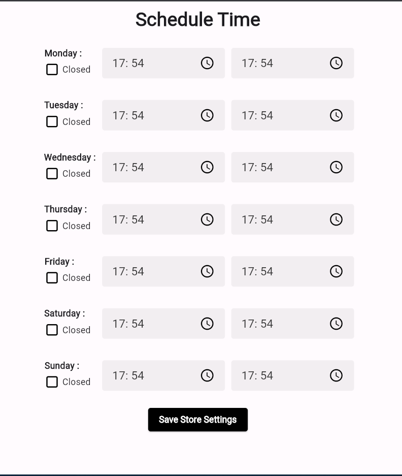
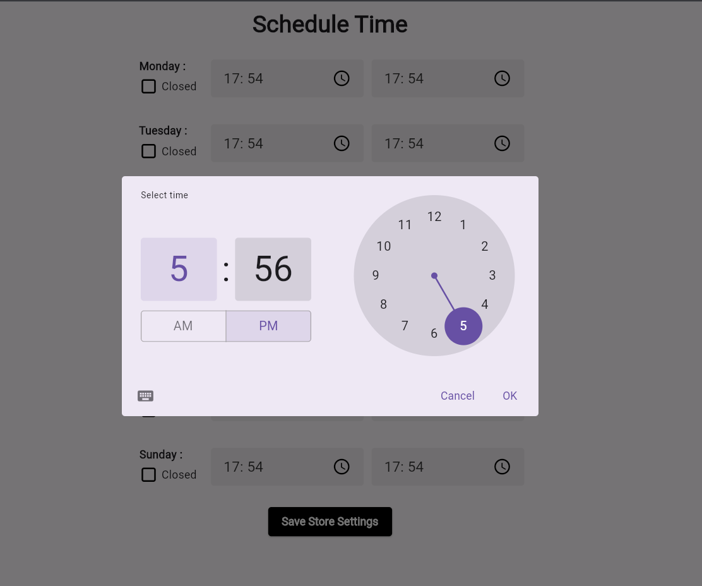
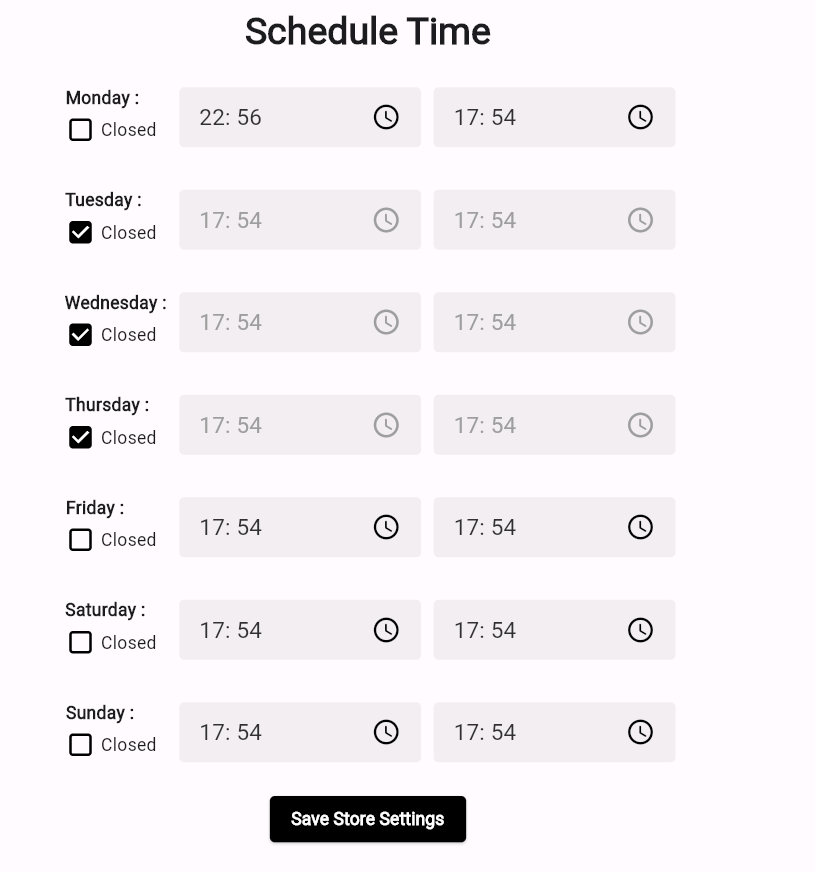

A week scheduler package for flutter that allows you to select scheduled time for every day.
You can customize the UI completely according to your requirements.

## Screenshots





## Preview
`Usage`

```dart
 StoreScheduler(
              borderRadius: 4,
              borderWidth: 0,
              showBorder: false,
              borderColor: Colors.black,
              buttonColor: Colors.black,
              pickerColor: Colors.black.withOpacity(0.05),
              dayStyle: const TextStyle(
                fontWeight: FontWeight.w600,
                fontFamily: "Times New Roman",
              ),
              buttonTextStyle: const TextStyle(
                color: Colors.white,
                fontWeight: FontWeight.bold,
                fontFamily: "Times New Roman",
              ),
              fontFamily: "Times New Roman",
              fontColor: Colors.black.withOpacity(0.8),
              pickerFontSize: 18,
              pickerFontWeight: FontWeight.w500,
              submitButtonText: "Save Store Settings",
              onChangeValue: (value) {
                print(value);
              },
            )
```


## Features
-  Allows you to choose start and end time for every day of the week.
-  Allows to set as close for partcular day.
-  Generated output in the form of JSON.

## Getting started

Add the following to your `pubspec.yaml`:

```yaml
dependencies:
  rashail_store_schedular: ^0.0.1
```

Run `flutter packages get`

## Example

```dart
import 'package:flutter/foundation.dart';
import 'package:flutter/material.dart';
import 'package:rashail_store_schedular/rashail_store_schedular.dart';

void main() {
  runApp(const MyApp());
}

class MyApp extends StatelessWidget {
  const MyApp({super.key});

  @override
  Widget build(BuildContext context) {
    return MaterialApp(
      title: 'App Example',
      theme: ThemeData.light(useMaterial3: true),
      home: const MyHomePage(title: 'Example App'),
    );
  }
}

class MyHomePage extends StatefulWidget {
  const MyHomePage({super.key, required this.title});
  final String title;

  @override
  State<MyHomePage> createState() => _MyHomePageState();
}

class _MyHomePageState extends State<MyHomePage> {
  @override
  Widget build(BuildContext context) {
    return Scaffold(
      appBar: AppBar(
        centerTitle: true,
        title: const Text(
          'Schedule Time',
          style: TextStyle(
            fontSize: 30,
            fontWeight: FontWeight.bold,
            fontFamily: "Times New Roman",
          ),
        ),
      ),
      body: Row(
        crossAxisAlignment: CrossAxisAlignment.start,
        mainAxisAlignment: MainAxisAlignment.center,
        children: [
          SizedBox(
            width: MediaQuery.of(context).size.width / 3,
            child: StoreScheduler(
              borderRadius: 4,
              borderWidth: 0,
              showBorder: false,
              borderColor: Colors.black,
              buttonColor: Colors.black,
              pickerColor: Colors.black.withOpacity(0.05),
              dayStyle: const TextStyle(
                fontWeight: FontWeight.w600,
                fontFamily: "Times New Roman",
              ),
              buttonTextStyle: const TextStyle(
                color: Colors.white,
                fontWeight: FontWeight.bold,
                fontFamily: "Times New Roman",
              ),
              fontFamily: "Times New Roman",
              fontColor: Colors.black.withOpacity(0.8),
              pickerFontSize: 18,
              pickerFontWeight: FontWeight.w500,
              submitButtonText: "Save Store Settings",
              onChangeValue: (value) {
                if (kDebugMode) {
                  print(value);
                }
              },
            ),
          ),
        ],
      ),
    );
  }
}
```
